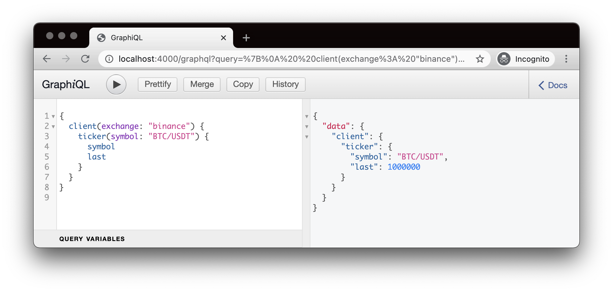

# graphql-ccxt

> wake up bears 🐻 ride bulls 🐂

## Credits

Tons of kudos to creators of [GraphQL](https://graphql.org/) and [CCXT](http://ccxt.trade). Coders that implemented both are so smart and passionate, for sure a great source of inspiration.

## Quick start

0. Get [this repository](https://github.com/fibo/graphql-ccxt) code.
1. Install deps: `npm install`
2. Launch the demo: `npm start`

Then point your browser to http://localhost:4000/graphql and try for example the following query

```graphql
{
  client(key: "binance") {
    ticker(symbol: "BTC/USDT") {
      last
    }
  }
}
```



## Demo source code

The demo server is implemented by the following code.

```javascript
const express = require('express')
const { graphqlHTTP } = require('express-graphql')
const { makeSchema, queries, GraphqlCcxtContext } = require('graphql-ccxt')

async function startDemo() {
  const context = new GraphqlCcxtContext()
  await context.addClient({ exchange: 'binance' })

  const rootValue = {
    ...queries
  }

  const schema = await makeSchema()

  const port = 4000

  express()
    .use(
      '/graphql',
      graphqlHTTP({
        schema,
        rootValue,
        context,
        graphiql: {
          defaultQuery: '{ clients: { key } }'
        }
      })
    )
    .listen(port, () => {
      console.log(
        `Running a graphql-ccxt server at http://localhost:${port}/graphql`
      )
    })
}

startDemo()
```

## License

[MIT](http://g14n.info/mit-license)
